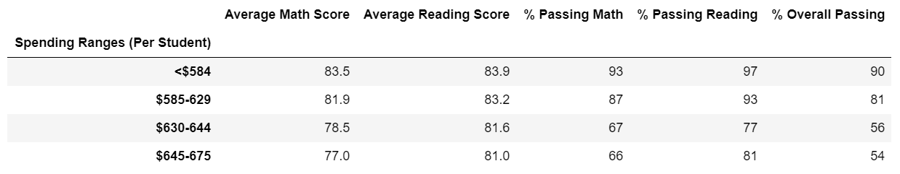

# School_District_Analysis
## Overview of the school district analysis
Based on the previous anlaysis to school performance, there exists evidence showing academic dishonesty. More specifically, the reading and math grades for Thomas High School ninth graders appear to have been altered. To address the issue and provide a more accurate feedback for school analysis, the following analysis is meant to evaluate how much impacts are induced by taking out the math and reading scores for Thomas High School while keeping the rest of the data. 
## Results
### How is the district summary affected?
As the images shown below, the "Average Math Score", "% Passing Math", "% Passing Reading" and "% Overall Passing" sections have been affected slightly. "Average Math Score" and "% Passing Math" decreases by 0.1% and 0.2% respectively. "% Passing Reading" and "% Overall Passing" drops by around 0.1% and 0.3% respectively.  
  
  

### How is the school summary affected?
As indicated in the images below, the "% Passing Math", "% Passing Reading" and "% Overall Passing" all have significant drop (around 30%) compared to the data before making the ninth-year grades to NaN.  

  

### How does replacing the ninth graders’ math and reading scores affect Thomas High School’s performance relative to the other schools?
By comparing the school summary results before and after, other schools' performance did get affected while Thomas High School's performance was impacted drastically. A dramatic decrease in "% Passing Math", "% Passing Reading" and "% Overall Passing" for Thomas High School can be observed.  

### How does replacing the ninth-grade scores affect the following:
#### Math and reading scores by grade
As shown in the image, only for Thomas High School, both 9th grade math and reading grades change to nan due to the score change.  
  
  
  
  

#### Scores by school spending
As shown in the image comparison below, for range ($630 ~ 644), "% Passing Math", "% Passing Reading" and "% Overall Passing" all decrease compared to before. "% Passing Math" changes from  73% ~ 67%, "% Passing Reading" changes from 84% to 77%, "% Overall Passing" changes from 63% to 56%.  
  
  

#### Scores by school size
As shown in the image comparison below, for school size Medium (1000 - 2000), "% Passing Math" drops from 94% to 88%, "% Passing Reading" decreases from 97% to 91% and "% Overall Passing" changes from 91% to 85%.  
  
  

#### Scores by school type
As shown in the image comparison below, for school type "Charter", "% Passing Math" drops from 94% to 90%, "% Passing Reading" decreases from 97% to 93% and "% Overall Passing" changes from 90% to 87%.
  
  

## Summary
In conclusion, through the updated school distric analysis after reading and math scores for the ninth grade at Thomas High School have been taken out, it can be noticed that all the categories that are relevant to Thomas High School will be affected. The four major changes are shown in "Math and reading scores by grade", "Scores by school spending" "Scores by school size" and"Scores by school type" in the sections including "% Passing Math", "% Passing Reading" and "% Overall Passing". All sections have dropped by several percentage which are mentiened in detail shown in the analysis above.  

